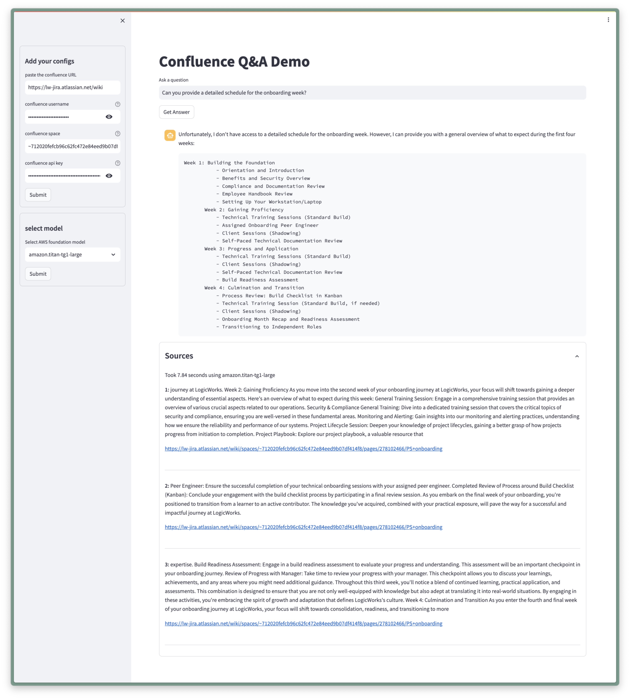
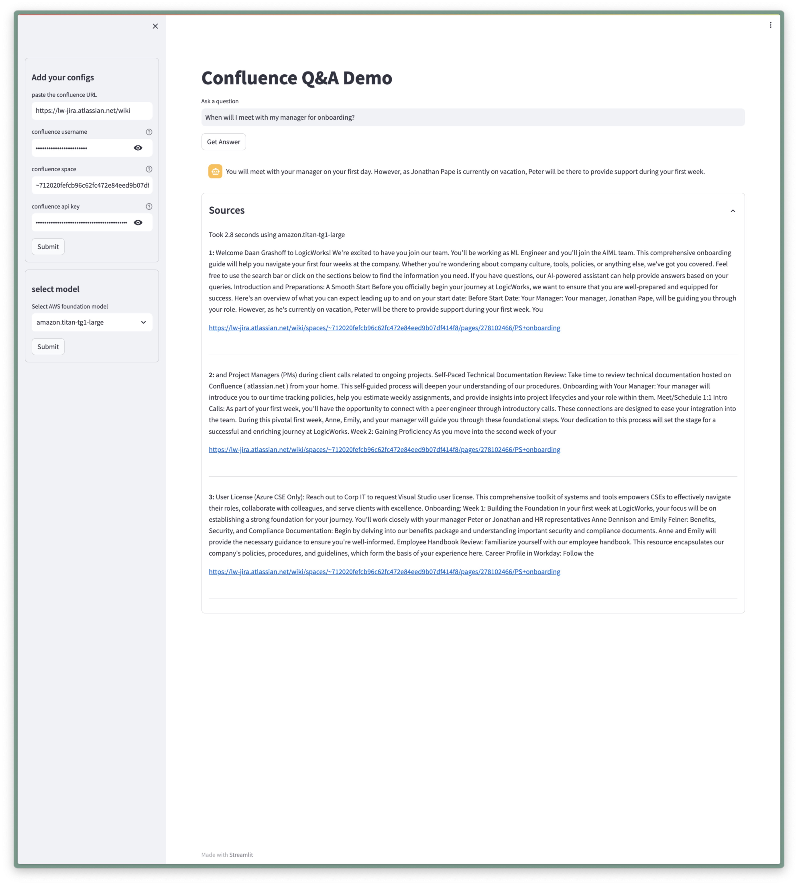
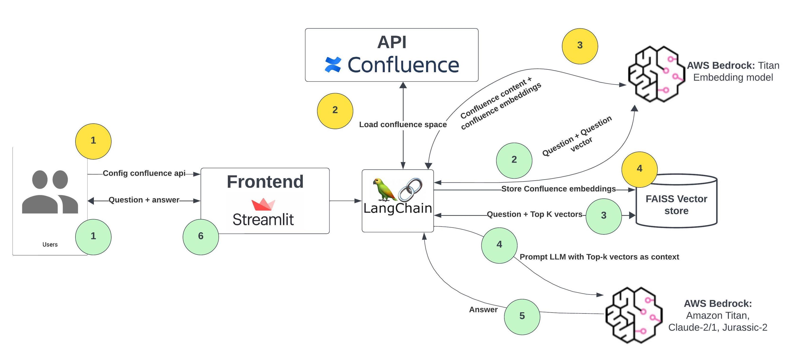
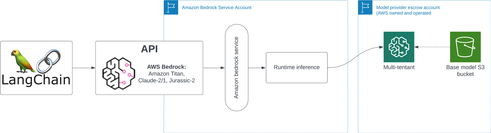
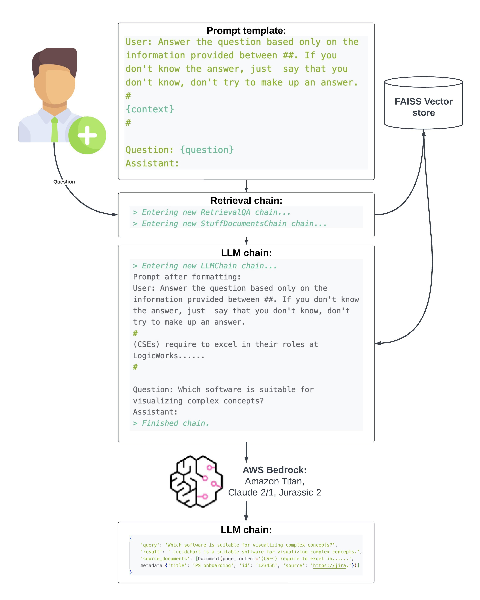

# AWS Bedrock-powered Confluence QA App with Streamlit

Delve into the capabilities of [AWS Bedrock](https://aws.amazon.com/bedrock/), the driving force behind this Confluence QA App. AWS Bedrock's seamless integration with foundation models (FMs) demonstrates its potential as a powerful solution-building platform. While here, also explore complementary open-source tools such as [LangChain](https://python.langchain.com/docs/get_started/introduction), [ConfluenceLoader](https://python.langchain.com/docs/integrations/document_loaders/confluence), and [FAISS](https://faiss.ai/index.html) that further amplify the application's capabilities.


## Overview

The Amazon Bedrock Confluence QA App introduces an innovative approach that allows you to directly access FMs from both third-party providers and Amazon itself. Through an intuitive API, you'll be able to explore a diverse range of models that align perfectly with your specific use cases.

## Features

- **LangChain Integration:** We have seamlessly integrated LangChain with our Confluence platform using the ConfluenceLoader from LangChain. Using the Streamlit UI, you can easily connect to different Confluence spaces by making simple adjustments to your username, API key, and space ID. The content you select is then embedded and stored in our FAISS vector database.

- **Effortless Integration:** Enjoy the simplicity of integrating AWS Bedrock, Confluence, and Streamlit to create your own AI QA chatbot without the need for complex deployment processes.
- **Interactive QA:** With the Streamlit app, you can now enter questions to directly query your Confluence space. The app will provide answers based on the context retrieved using FAISS. Moreover, the source documents used to generate the questions will be returned, allowing you to explore the Confluence pages for further reading.

- **Enhanced Data Privacy:** Your data privacy is of utmost importance to AWS. With AWS Bedrock, your Confluence space data is secure and isolated. No unauthorized access is granted to your data that interacts with the AWS Bedrock API. Customer data is never used to enhance Amazon Titan models for other users, and it's never shared with other foundation model providers.

- **Powerful Foundation Models:** The Amazon Bedrock Confluence QA App employs the robust AWS Titan model for generating embeddings and handling the QA process. However, we understand that different scenarios might require different models. That's why we offer seamless integration with the AWS Bedrock foundation model catalog. With just a few clicks, you can switch to another suitable model that aligns perfectly with your specific use case.

AWS ensure us that your Confluence space data remains exclusively in your control, empowering you with a secure and impactful QA experience.

## Experience the App

Here are some visual representations of the Amazon Bedrock Confluence QA App in action:

| Example 1            | Example 2            |
| -------------------- | -------------------- |
|  |  |


## Getting Started with the Confluence QA App

### Prerequisites
1. **SageMaker Studio**: For the best experience, use SageMaker Studio. Ensure your instance is set up and running.
2. **Role Permissions**: Your SageMaker role should have access to the AWS Bedrock service.
3. **Clone the Repository**: Ensure you have `git` installed on your system. Use the command `git clone` to download the project locally.

### Installation

1. **Download AWS Bedrock SDK**: As AWS Bedrock SDK isn't part of the standard AWS CLI/boto3 release yet, start by downloading the necessary dependencies.
    ```bash
    sh ./download_dependencies.sh
    ```

2. **Install Custom Libraries and Dependencies**: Run the installation script to set up the necessary libraries.
    ```bash
    sh ./install_dependencies.sh
    ```

   A full list of requirements can be found in `requirements.txt`.

3. **Launch the Streamlit Frontend**: Once everything's set up, run the following script to start the frontend:
    ```bash
    sh ./run_sm.sh
    ```

    This will provide a link to access the Streamlit frontend.

### Usage

1. **Configure the App**:
   - Enter your Confluence `username` and `API key`.
   - Specify the `Confluence page URL`.
   - Indicate the `space` for your queries.

2. **Gather and Process Content**:
   - Click "Submit". The app will fetch content from Confluence and segment it into chunks for storage in the FAISS vector store.
   - Once complete, you can query the Confluence page content by writing questions in the app.

3. **Choose Your Model**:
   - Switch between AWS Bedrock models using the dropdown. Select the model you wish to experiment with.

4. **Inference Settings**:
   - Fine-tune the response by adjusting inference settings like `max token output`, `temperature`, `top-k`, and `top-p`.


## Solution Architecture
For our example, we will create a QA chatbot to assist on onboarding new employees. This chatbot enables new joiners to directly seek answers from the resources available on Confluence.

**Initial setup in yellow (occurs once):**
1. Users input their username, Confluence API key, space, and Confluence wiki URL.
2. LangChain interfaces with the Confluence API, fetching and dividing all pages into smaller chunks from the specified space.
3. Confluence content chunks will be embedded using the AWS Bedrock Titan embedding services.
4. Embeddings are stored in the FAISS vector database.
   
**Interaction for new joiners in green:**
1. Users use the Streamlit interface to ask questions related to the onboarding process, HR, or general company queries.
2. LangChain will use AWS Bedrock to embed the question.
3. LangChain uses question embeddings to retrieve the top-k vectors containing potential answers.
4. Using the prompt-template, top-k contexts, and the question, LangChain prompts the AWS Bedrock language model.
5. AWS Bedrock provides answers through its API.
6. Streamlit displays the answers and pertinent contexts. These contexts are directly connected to the original Confluence Space Page and can be accessed directly through the attached URL.
   
<!--   -->


### LangChain's High-Level Design Architecture

**Interaction with AWS Bedrock API:**
- **Core Functionality:** The AWS Bedrock API acts as a bridge over the SageMaker model endpoint, simplifying the switch between different model names and deployment configurations.
- **Endpoint Direction:** Users are smoothly guided to the actual SageMaker endpoint where the model is stored.
- **Model Housing:** The model is located within an AWS-owned account.
- **Model Type:** We use foundation models, hosted on a multi-tenant endpoint. This means we're sharing access with other users of the AWS Bedrock API.

<!--   -->



### Langchain Interaction Flow

- **Components:** User, Vectorstore, Model
- **Approach:** Use prompt engineering for task context and retrieval augmented generation (RAG) for onboarding data from Confluence.

**Procedure:**
1. Start with a prompt template to indicate action, incorporating both context and a user query.
2. User inputs a question. This is used to fetch relevant context from the vector store.
3. Merge the context and user's question with the prompt template.
4. Send the populated prompt to AWS Bedrock API to produce the desired response.





## Eval Results for AWS Bedrock Titan, Langchain, and Confluence Integration

Welcome to the evaluation summary of our innovative setup, combining AWS Bedrock Titan, Langchain, and Confluence. This integrated solution offers a powerful approach to address various scenarios, including inquiries about LogicWorks' new employee onboarding, HR matters, AI team details, and general queries. Our evaluation process consisted of two distinct testing phases aimed at understanding the performance of this arrangement.

### Test 1: Assessing Model's Responses

In the initial test phase, we designed a range of questions, some of which had corresponding entries on our Confluence pages, while others did not. We provided explicit instructions to the model, urging it to refrain from generating fabricated responses and instead acknowledge its inability to derive accurate answers from the given context.

However, we observed instances where the model exhibited what we refer to as "hallucinations." These were imaginative responses generated for questions that the model couldn't precisely address. Despite being plausible, these responses deviated from the prompt's guidance. Upon careful analysis, we found that only 56% of the generated answers were correct out of a total of 58 questions in the test set.

### Test 2: Enhanced Performance

The outcomes of our second test phase were notably more encouraging. Instances of speculative responses or "hallucinations" were significantly reduced. The model displayed an improved ability to leverage different aspects of the context and synthesize relevant answers. However, a few responses still exhibited inaccuracies.

The inaccuracies primarily stemmed from the model's attempts to extrapolate from contexts with limited available information. In such cases, the model's elaborations occasionally deviated from validity due to the scarcity of comprehensive data on the subject matter.

In this phase, we achieved a remarkable 94% correct rate out of the 60 questions that we assessed. This outcome underscores the effectiveness of the integrated setup in delivering accurate and valuable responses, particularly when ample context is available.

We're excited about the progress demonstrated in our evaluation and look forward to refining and enhancing the capabilities of this integration further. Your engagement and interest in our journey are greatly appreciated.

## Tips to Elevate Your QA Experience:

1. **Prompt Template Experimentation:** Engage in thoughtful prompt engineering. The prompt is pivotal for an effective QA/chatbot application. Explore zero-shot, one-shot, or few-shot prompts to tailor the interaction.

2. **Quality Context:** Remember, the output quality relies on the input data quality. Complete, accurate context is essential for generating reliable responses.

3. **Fine-tune Model Parameters:** Delve into additional AWS Bedrock model parameters like temperature, topP, and stop sequences to calibrate responses.

4. **Customize for Use Cases:** Tailor the prompt template to the specific use case. Whether it's step-by-step guides or other formats, adapt the template to your expectations.

For more comprehensive insights into AWS Bedrock utilization, explore our detailed blog on the topic.

Thank you for accompanying us on this exploration into the realm of AWS Bedrock Titan, Langchain, and Confluence integration!

---
*Note: These evaluation results are based on a specific testing setup and may vary depending on the context and use case.*