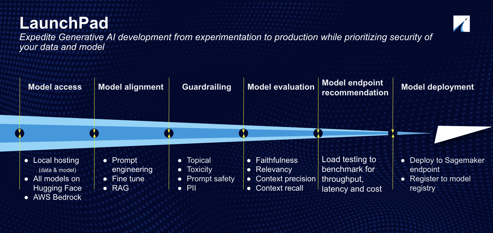

# GenFlow: Simplifying Generative AI for Everyone

## Introduction

The field of generative AI has revolutionized various industries by enabling the creation of unique and innovative content. GenFlow provides a no-code platform that simplifies the exploration of generative AI models for non-technical users, offering easy access to state-of-the-art (SOTA) models without the need for coding expertise.

## GenFlow

GenFlow is a no-code tool designed to democratize access to generative AI models. It is specifically tailored for non-technical domain experts and ensures data privacy and security. GenFlow offers a suite of applications including TextGen, ImageGen, VideoGen, and MusicGen, each delivered through AMI images curated by Logicworks. It provides a web UI interface playground for users to explore SOTA models in various modalities. This blog will focus on leveraging TextGen for accelerating the exploration and development of generative AI for text applications.

  

## TextGen

TextGen distinguishes itself from other solutions by offering a no-code environment to access and experiment with text generative applications. It allows users to deploy models in their own Virtual Private Cloud (VPC) in just a few clicks, ensuring data privacy and security.

By deploying in a VPC, users maintain control over their data, reducing the risk of breaches and unauthorized access. TextGen offers a customizable chat interface, prompt templates, LoRA fine-tuning, and AWS Kendra RAG. It also assists in deploying the optimal SageMaker endpoint via load testing and enables users to register models to SageMaker’s model registry, enhancing the MLOps workflow.

## Solution Architecture

- Access to GenFlow is provided via an S3 path shared with the customer's AWS account.
- An SNS topic is created during CloudFormation deployment, notifying users upon EC2 readiness and providing web UI and Grafana access.
- An EC2 instance deploys the GenFlow AMI image from Logicworks' ECR, with solution-specific images available.
- Users can copy data from an S3 bucket into the instance for model fine-tuning.
- EFS provides elastic storage volume, and AWS Kendra integration is available for RAG applications.
- Foundational models or fine-tuned LoRA models can be deployed to a SageMaker endpoint and tested via the web UI.
- Data is encrypted at rest using KMS, with separate keys for EBS, EFS, and S3. Data-in-transit encryption is enforced by default.
- GenFlow EC2 instance is deployed in a private subnet, with an application load balancer and WAF for enhanced security.
- SSL termination is available for customers with their own domain on Route53 using AWS Certificate Manager.

## Security

Security is paramount when handling private data, which may contain sensitive business or personal information. GenFlow enhances security with:

- KMS keys for encrypting storage services and automatic key rotation.
- Secure internet access through a NAT Gateway.
- WAF-enabled Application Load Balancer to protect against application layer attacks.

## Monitoring

TextGen employs Grafana to provide insights on resource usage:

- Uptime, CPU Cores, and CPU Busy.
- RAM Total and Memory Utilization.
- ROOT Fs and Disk Utilization.
- GPU device details, including count, utilization, average temperature, and power consumption.

Users receive monitoring dashboard access during deployment, with credentials set via CloudFormation.

