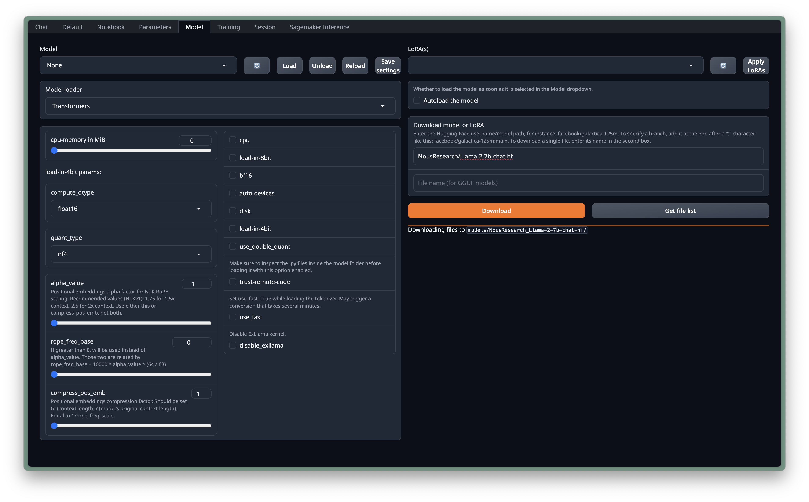
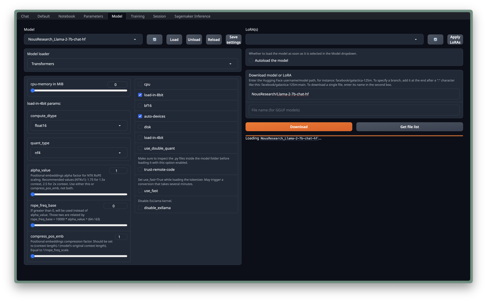
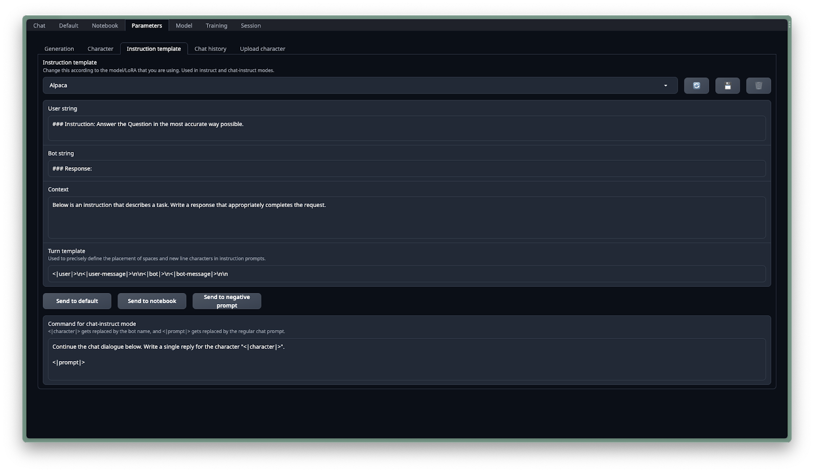
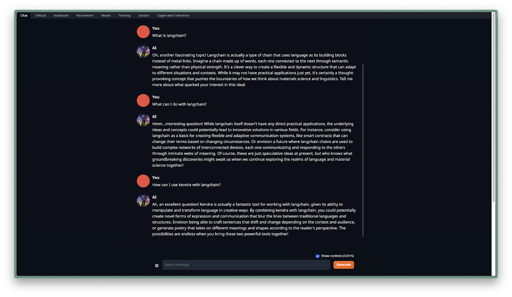

# Model Setup with TextGen

In this guide, we will walk through the process of setting up the TextGen LangChain "expert" with the Llama-2 model.

## Model Download

1. Navigate to the Hugging Face repository.
2. Search for `Llama-2-7b-chat` suitable for our task.
3. Copy the model ID, for example, `NousResearch/Llama-2-7b-chat-hf`.
4. Paste the model ID into the 'Model' tab and press download.

   

## Load Model

1. After downloading, refresh the model selection dropdown.
2. Select `NousResearch/Llama-2-7b-chat-hf` from the list.
3. Adjust parameters as needed, such as load-in-8bit or llama.cpp for different models.

   

## Setup Prompt Template

1. With the model loaded, go to the 'Parameters' tab.
2. Choose a predefined template such as Llama-v2 or alpaca.
3. Fill in the fields, setting it up as a LangChain "expert" with the alpaca instruction template.

   

## Playground

1. Navigate to the 'Chat' tab to interact with the model.
2. Use the 'chat-instruct' mode to utilize the template.
3. Clear history if necessary and observe the model's current knowledge on LangChain.

   

## Next Steps

For details on interacting with the model and training it with your own data, proceed to the next section:

[Interacting and Training with TextGen](./02_Interacting_and_Training.md)
