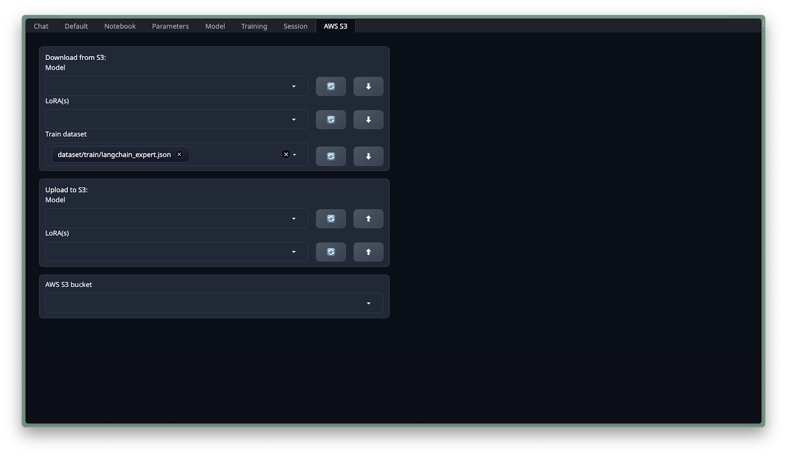

# Interacting and Training with TextGen

This section covers the training process to enhance the model's knowledge about LangChain using TextGen.

## S3 File Structure

For the GenFlow-TextGen app to seamlessly interact with your S3 bucket, it's crucial to maintain a specific file structure. This ensures that datasets, models, and LoRA configurations are easily accessible. In this tutorial, you will be required to download the `langchain_expert.json` from the provided GitHub repository. Once downloaded, you should upload this file into the 'train dataset' directory within your linked S3 bucket.

Here's the required structure:
- **Datasets**: Store your training datasets in the following path: `dataset/train/*.json`. The app will look for `.json` files under this directory when you choose to download training data.
- **LoRAs**: All LoRA configurations should be placed directly under the `loras/` directory.
- **Artifacts**: If you have model artifacts, they should be stored as: `artifacts/*/model.tar.gz`. This structure allows the app to recognize and download model artifacts.
- **Models**: All other model files should be placed directly under the `models/` directory.

## Download Training Dataset

To download the training dataset:

1. Navigate to the AWS S3 tab within TextGen.
2. From the 'train dataset' dropdown menu, select `langchain_expert.json`.
3. Click the download button located next to it. Before proceeding, ensure `langchain_expert.json` has been correctly uploaded to the specified directory.
4. If you've recently uploaded the file, click the 'refresh' button to update the list of available files for download.

## Uploading to S3

The GenFlow-TextGen app also provides the capability to upload models and LoRA configurations directly to your S3 bucket.

To initiate the upload:

1. Choose the model or LoRA configuration you wish to upload.
2. Click on the 'Upload' button located adjacent to your selection.

## Fine-tuning

In this section, we will train a LoRA to embed some missing information about LangChain. We do this by using the just downloaded dataset `langchain_expert.json`.

1. Navigate to the 'Training PRO' tab.
2. Name your LoRA e.g., `langchain expert`.
3. On the right, set the data format to 'alpaca-format' and choose the `langchain_expert` dataset. If not visible, hit 'Refresh'.
4. Adjust parameters:
   - LoRA Rank: `256`
   - LoRA Alpha: `512`
   - Cutoff Length: `256`
   - True Batch Size: `2`
   - Gradient Accumulation Steps: `1`
   - Epoch: `15`
5. Click 'Start LoRA Training'.

## Using Fine-tuned Model

After the LoRA training is complete:

1. Head to the 'Model' tab and click 'Reload Model'.
2. From the dropdown, select your LoRA (`langchain expert`). If not visible, refresh the list.
3. Click 'Apply LoRA' to load it.
4. In the 'Parameters->Generation' tab, input a random seed to ensure consistent model outputs.
5. Engage with your enhanced model in the 'Chat' tab.

The screenshot below illustrates the improved responses in the chat interface after applying the fine-tuned LoRA.

## Next Steps

To further enhance the capabilities of your model, you can integrate Kendra Retrieval Augmented Generation (RAG) for advanced question-answering features. Proceed to the next section for detailed instructions:

[Enhancing with Kendra RAG](03_Enhancing_with_Kendra_RAG.md)
