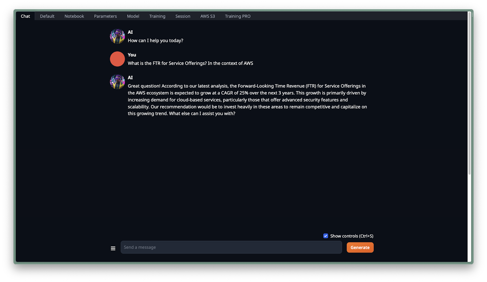
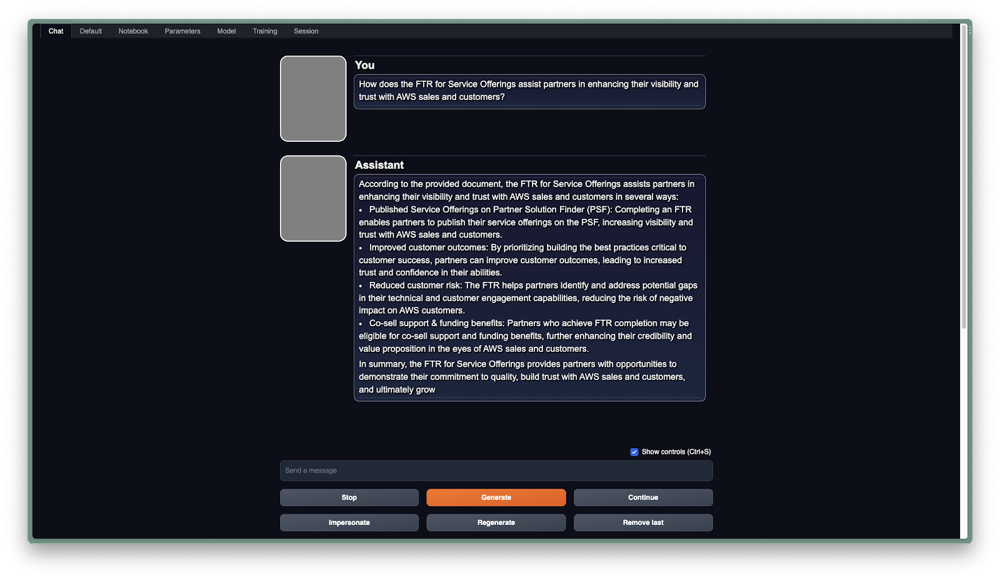

# Enhancing Chat with Kendra RAG (Retrieval Augmented Generation) Extension

To enrich your chatbot's capabilities beyond the inherent knowledge of your language model, consider integrating the Kendra RAG extension. For example, our llama-2-7b-chat model may not be aware of specifics contained in the "AWS Foundational Technical Review for Service Offerings Guide."

The image below shows a chat interaction without the Kendra RAG extension. In this scenario, the model does not have any information about the FTR document from AWS:

By integrating Kendra RAG, the chatbot can access a wider range of information and provide more accurate answers based on the AWS documents.

## Getting Started with Kendra

### Activating and Configuring Kendra

#### Activate Kendra

- Begin by accessing your AWS console to set up Kendra.
- Create a Kendra index to store the AWS Foundational Technical Review for Service Offerings Guide.

#### Connect to an S3 Bucket

- During index creation, connect Kendra to an S3 bucket containing the guide document.

#### Index Creation

- Complete the index creation, including attributes and permissions setup.
- Once the index is ready, Kendra will be set for use.

## Direct Use with TextGen

### Ensure API Extension is Active

- Confirm that the API extension is functioning for Kendra RAG.

### Navigate to the Chat Interface

- Open LaunchPad and go to the "Chat" tab.

### Access the RAG Configuration

- Find the RAG section and input the Kendra Index ID.

### Activate AWS Kendra Integration

- Enable the "AWS Kendra" feature and apply your settings.

By activating these settings, LaunchPad will use the LangChain Kendra Conversational Retrieval Chain to enrich chatbot responses with content fetched from Kendra documents.

## Enhanced Chatbot Interaction with Kendra Integration

With the Kendra RAG extension now integrated, the chatbot gains access to previously missing knowledge. For instance, when asked about specific documents such as the "AWS Foundational Technical Review for Service Offerings Guide," the chatbot can now retrieve and incorporate this information into its responses, as demonstrated in the interaction below:

This integration significantly expands the chatbot's utility, allowing it to provide detailed and relevant information based on the extensive content available in Kendra-indexed documents.

## Next Steps

For information on how to optimize the deployment of your models for better performance and efficiency, proceed to the next guide:

[Optimizing Deployment](04_Optimizing_Deployment.md)

## Integration via SageMaker Inference Endpoint

### Access SageMaker Inference Tab

- In TextGen, go to the SageMaker inference tab designed for RAG.

### Confirm Pre-requisites

- Ensure you have an active SageMaker endpoint and a configured Kendra index.

### Enable Features

- Activate features necessary for RAG by checking the corresponding boxes.

### Input Details

- Enter the Kendra Index ID and select the SageMaker endpoint from the dropdown.

#### For Additional Flexibility

- Update Kendra Index ID and SageMaker Endpoints as needed.
- Customize the LangChain template for your specific requirements.
- Refine Prompt Engineering to optimize retrieval from your Kendra catalog.
- Condense Chat History to improve the chatbot's response relevance and coherence.

By following these steps, your chatbot will have enhanced knowledge retrieval capabilities, leveraging the AWS Kendra service for more accurate and detailed responses.

