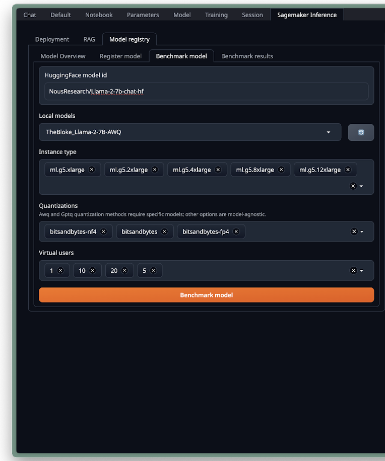
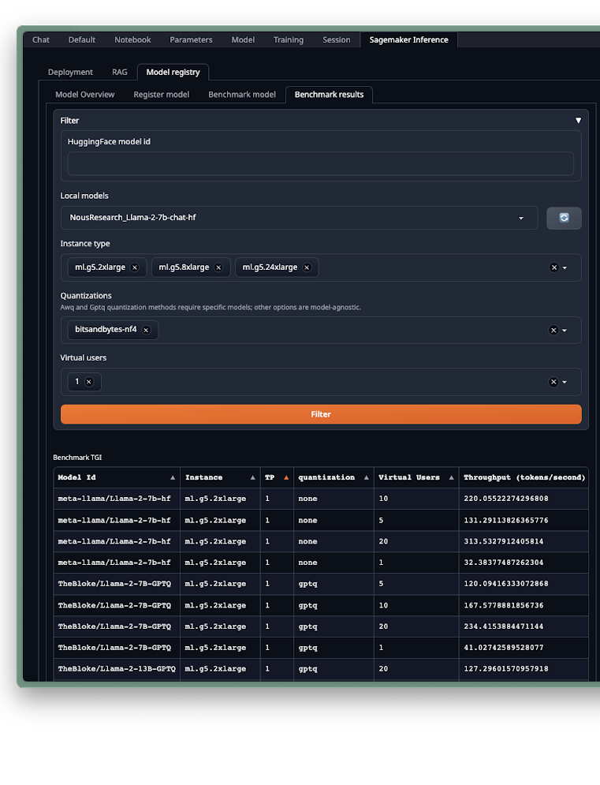
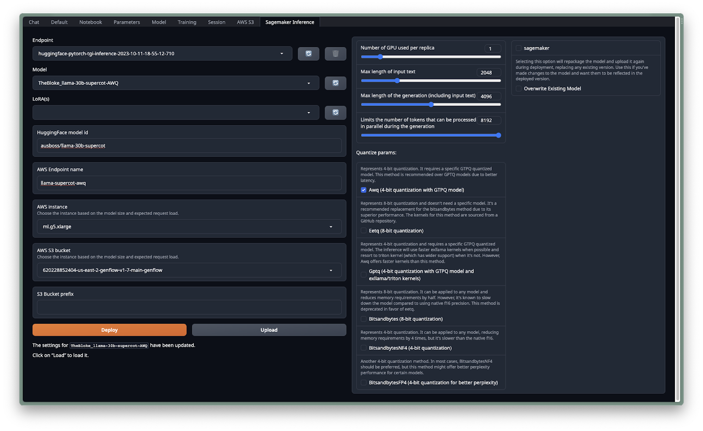
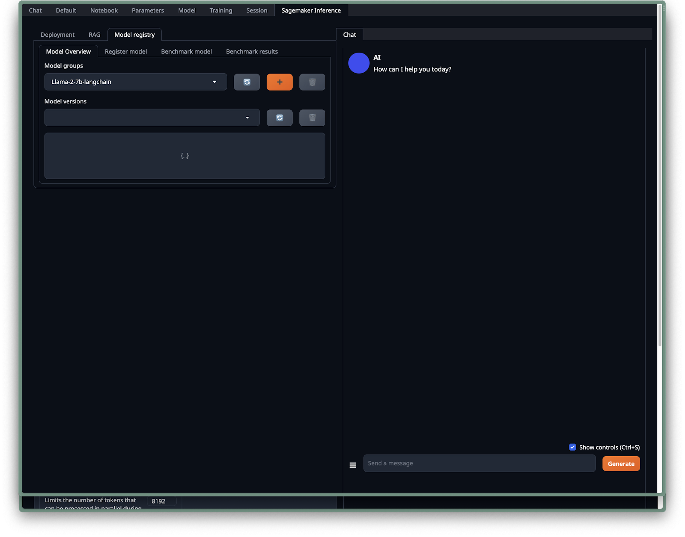

# Optimizing Deployment

Optimizing the deployment of your AI models is crucial for achieving the best performance and cost efficiency. This guide will walk you through running endpoint recommendations and deploying your models using SageMaker.

## Run Endpoint Recommendations

### Navigate to the Benchmarking Section

- Go to the top of the page and select the SageMaker inference tab.
- Inside SageMaker inference, find the Benchmark model sub-tab.

### Select Your Model

#### For Hugging Face Models:

- Enter “NousResearch/Llama-2-7b-chat-hf” into the 'HuggingFace model id' field.

#### For Local Models:

- Select `NousResearch_Llama-2-7b-chat-hf` from the Local models dropdown menu.

### Choose an Instance Type

- Use the Instance type dropdown to select an AWS instance, such as `ml.g5.xlarge` or `ml.g5.2xlarge`.

### Configuring Quantizations

- Pick the quantization method that suits your model's needs.

### Setting Virtual Users

- Define the number of virtual users to simulate different levels of user traffic for load testing.

### Initiate the Benchmark

- Click on the `Benchmark model` button to start the benchmarking process.

The following screenshots illustrate the benchmarking interface and options available on the TextGen platform:

## View Benchmark Results

Once the benchmarks are complete, you can view and analyze the results:

- Access the Benchmark results tab to see the outcomes.
- Apply filters to refine results by Model ID, Instance Size, Throughput, Quantization Effects, Virtual Users, and Latency (p95).
- Review the data to understand the model's performance and efficiency.

## Understanding Benchmark Results

The benchmark results provide several key metrics that help you understand the performance of your models under different configurations. Here's what each column represents:

- **Model ID**: This column shows the unique identifier for each model, allowing you to locate and differentiate between the models you have tested.

- **Instance Size**: This metric lets you compare how the model performs across different AWS instance types, which can vary in terms of CPU, memory, and GPU capabilities.

- **Throughput (TP)**: Throughput is measured in the number of tokens that the model processes per second, indicating the speed of the model's inference capabilities.

- **Quantization Effects**: If you're using quantization to reduce the model size or compute requirements, this column shows the impact of different quantization methods on the model's performance.

- **Virtual Users**: This column indicates how well the model handles load by simulating a certain number of virtual users interacting with the model concurrently.

- **Latency (p95)**: Latency at the 95th percentile measures the response time in milliseconds for 95% of the requests, providing insight into the model's responsiveness under load.

- **Review Data**: By looking through the filtered data, you can gain insights into each model's performance, scalability, and efficiency, helping you make informed decisions about which setup is best for your needs.

The screenshot below shows a detailed view of the benchmark results with these columns:

By analyzing these metrics, you can optimize your model deployment to achieve the best balance of speed, accuracy, and cost.

# Deploy SageMaker Endpoint

Deploying your model as a SageMaker endpoint is a crucial step in making it available for use in production. Here's how to deploy your model:

1. Proceed to the 'SageMaker Inference' section within TextGen.
2. In the model dropdown list, select `NousResearch_Llama-2-7b-chat-hf`.
3. If you wish to deploy it with the LoRA fine-tuning, also select the `langchain expert` LoRA from the options.
4. Specify the AWS endpoint name.
5. For the AWS instance, we can opt for the `g5.xlarge` instance, which is compatible with our model.
6. Select an S3 bucket from the dropdown menu.
7. Click the 'Deploy' button to start the deployment process. The system will compress your model using Gzip and upload it to the specified S3 bucket.

Below is a screenshot of the deployment interface on the TextGen platform:

The duration of the deployment process will depend on the type of model you're deploying:

- For a direct deployment using a HuggingFace model ID, the process should take approximately 6 minutes.
- For a local model deployment, expect it to take about 10 minutes.
- If applying a LoRA to your local model, the process may take around 15 minutes.

> **Note**: Once you're done using the endpoint, you can easily delete it by clicking on the trash bin icon located to the right of the endpoint dropdown. This action will remove the SageMaker endpoint.

## Test SageMaker Endpoint

To test the deployed SageMaker endpoint:

1. Stay within the 'SageMaker Inference' tab and locate the chat window to the right.
2. On the left, check the box labeled 'SageMaker' to indicate that you intend to use the SageMaker endpoint.
3. From the “endpoint” dropdown, select the endpoint you have recently set up.
4. Engage with the chat as you typically would, using the 'Generate' button to interact.
5. Alternatively, access the 'Chat' tab to use the chat window in a similar manner.

The following screenshot displays the chat interface after deploying the model through the SageMaker endpoint:

## Next Steps

With your model now deployed, the next important phase is testing its performance and integrating it with your MLOps workflow. For guidance on these crucial steps, proceed to the following section:

[Test and Registry with SageMaker](05_Testing_and_Registry.md)

