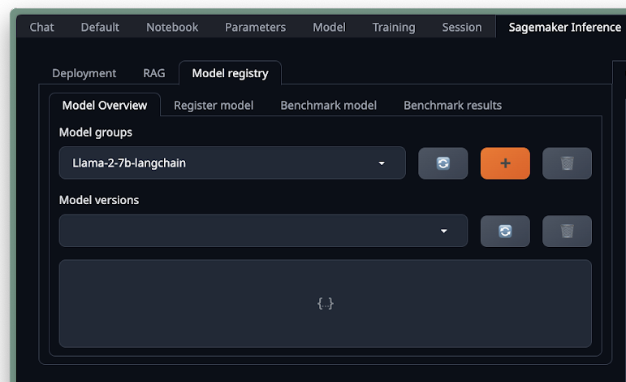
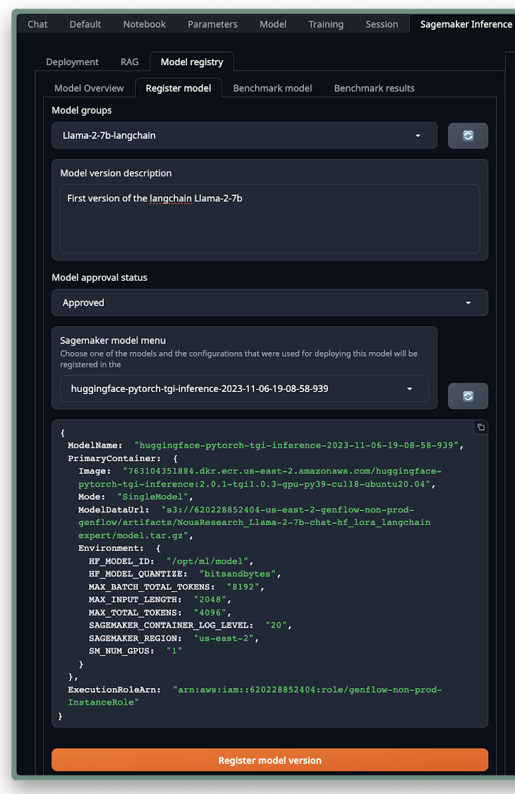

# Model Registry Management

Integrating evaluated models from GenFlow into your MLOps workflow is streamlined through SageMaker’s model registry. Here's how you can manage and register your models:

## Navigate to Model Overview Tab

### Manage Model Groups

You can create new model groups or delete existing ones to keep your registry organized. For our purpose, we will create a new group named `Llama-2-7b-langchain`.

### Inspect Models

Use the model version catalog to review the metadata for each model, which includes details and version history. If there are no models listed, add the latest deployed one.

## Go to the Register Model Tab

### Register Model

Select the recently created `Llama-2-7b-langchain` model group, and then choose the `Llama-2-7b langchain` model from the SageMaker model menu dropdown. The model's details will be displayed in JSON format as shown below.

### Verify Parameters

Ensure all model parameters are correct, including environmental variables and container settings. This artifact should include the trained LoRA.

### Set Approval Status

Approve and register the model based on evaluative criteria and its alignment with our standards. The model should now be part of the SageMaker model registry, ready for deployment.

# Conclusion: The Power of GenFlow and TextGen

As we wrap up our journey through the capabilities of GenFlow, it's clear that this platform stands as a testament to the advancements in no-code AI solutions. GenFlow's TextGen application, in particular, has demonstrated its prowess by simplifying the complexities of AI model deployment, management, and optimization.

TextGen's intuitive interface, coupled with the robust backend infrastructure provided by AWS services, empowers users to harness the power of generative AI models without delving into the technicalities of machine learning workflows. From fine-tuning models with LoRA to integrating the vast knowledge available through Kendra RAG, TextGen has paved the way for non-technical experts to innovate and implement AI solutions that were once deemed too complex.

The integration with SageMaker’s model registry and the ease of deploying and testing models showcases GenFlow's commitment to streamlining the MLOps lifecycle. Users can now confidently manage their AI deployments, ensuring that their models are not only performant but also align with the best practices and compliance standards required in today's digital ecosystem.

In essence, GenFlow, with its TextGen application, is not just a tool but a bridge to the future of AI accessibility—where the power of generative models is just a few clicks away, ready to be leveraged by thinkers, creators, and innovators across industries.